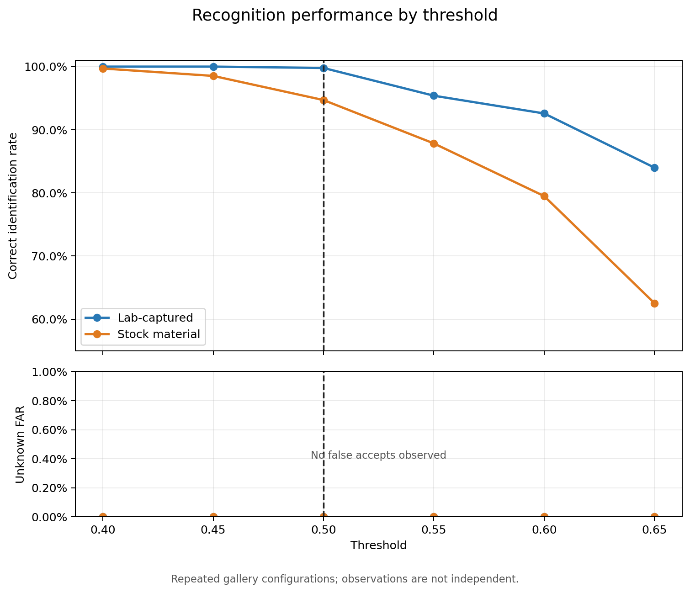
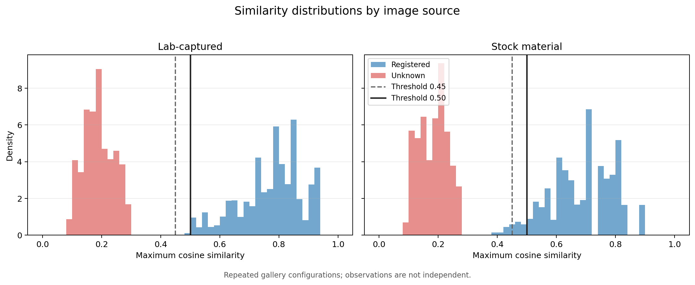

# 顔認証性能評価レポート

## 1. 目的

Smart Gateの本番実装と同等の顔検出・照合条件を用いて、登録者の認証性能と
未登録者の誤受入を評価する。本評価では、研究室環境で撮影した画像とフリー
素材では撮影条件や画像品質が異なることを考慮し、両者を分けて集計する。

## 2. データセット

評価には11人、合計73枚の顔画像を使用した。内訳は次のとおりである。

| 区分 | 人数 | 画像数 | 主な用途 |
| --- | ---: | ---: | --- |
| 研究室撮影群 | 6人 | 41枚 | 実運用環境に近い性能の確認 |
| フリー素材群 | 5人 | 32枚 | 撮影条件が異なる画像に対する頑健性の確認 |
| 合計 | 11人 | 73枚 | 全体傾向の確認 |

人物ごとの画像枚数は5～10枚であり、すべて同数ではない。枚数別の人数は
次のとおりである。

| 1人あたりの画像数 | 人数 |
| ---: | ---: |
| 5枚 | 2人 |
| 6枚 | 5人 |
| 7枚 | 1人 |
| 8枚 | 2人 |
| 10枚 | 1人 |

フリー素材群は、カメラ、照明、背景、解像度、画像圧縮などの条件が研究室撮影
群と統一されていない。そのため、全画像をまとめた結果だけで実運用性能を判断
せず、研究室撮影群を主評価、フリー素材群を補助的なストレス試験として扱う。

## 3. 実験条件

- 顔認証モデル: InsightFace `buffalo_sc`
- 顔検出入力サイズ: `320 x 320`
- 実行プロバイダー: CPU
- 登録画像数: 1人につき3枚
- 特徴量: L2正規化した顔Embedding
- 類似度: コサイン類似度
- 照合方法: 全登録Embeddingのうち最大類似度を採用
- 顔が0人または複数人の画像: 照合しない
- 評価閾値: `0.40`、`0.45`、`0.50`、`0.55`、`0.60`、`0.65`

11人のうち1人を未登録者として登録対象から外し、残り10人を登録者として
評価した。未登録者を交代させながら全員について実施し、登録者については
登録に使用する3枚の組合せを変更して評価した。

### 3.1 評価手順

1. 73枚の画像を1回ずつ読み込み、顔検出とEmbedding抽出を行う。
2. 顔がちょうど1人検出された画像だけ、照合用Embeddingを保持する。
3. 11人のうち1人を未登録者とし、残り10人を登録者とする。
4. 各登録者の画像から3枚を選び、10人分、合計30個のEmbeddingを登録する。
5. 各登録者の残りの画像を登録者テストに使用する。未登録者の全画像は、
   未登録者テストに使用する。
6. テスト画像と30個の登録Embeddingとのコサイン類似度を計算し、最大値と
   その登録者を取得する。
7. 同じ最大類似度に6種類の閾値を適用し、閾値ごとに結果を集計する。
   閾値ごとに顔特徴を再抽出しているわけではない。
8. 未登録者を交代し、11人全員が1回ずつ未登録者になるまで繰り返す。

### 3.2 登録画像の組合せ

各人物について、保有する画像から3枚を選ぶ組合せを作成した。例えば画像が
5枚の場合、登録画像の組合せは5C3、すなわち10通りとなる。

画像枚数が人物ごとに異なるため、1回の未登録者評価における反復数は、登録者
10人の中で最も組合せ数が多い人物に合わせた。組合せ数が少ない人物は、用意
した組合せを先頭から循環させて使用した。このため、同じ画像および登録組合せ
が複数回評価される。

登録用に選ばれた画像のどれかから顔がちょうど1人検出できない場合は、本番の
登録処理と同様に、その登録組合せを不成立として集計から除外する設計とした。
今回は全73枚から顔を1人だけ検出できたため、不成立となった組合せはなかった。

### 3.3 判定区分と集計方法

| 判定区分 | 定義 |
| --- | --- |
| 本人正解 | 登録者の画像を正しい人物として閾値以上で認証 |
| 本人拒否 | 登録者の最大類似度が閾値未満 |
| 誤識別 | 登録者の画像を別の登録者として閾値以上で認証 |
| 正しい拒否 | 未登録者の最大類似度が閾値未満 |
| 誤受入 | 未登録者の画像をいずれかの登録者として閾値以上で認証 |

本人正解率は「本人正解数 ÷ 登録者テスト数」、未登録者誤受入率は
「誤受入数 ÷ 未登録者テスト数」とした。閾値ごとの集計対象は、登録者
45,888件、未登録者8,120件の合計54,008件である。

これらは、登録画像の組合せが異なる状態で照合を繰り返した評価件数であり、
54,008件の独立した顔画像を使用したという意味ではない。同じ画像と組合せを
繰り返し使用しているため、本評価は厳密な統計的性能保証ではなく、閾値と
認証結果の傾向を確認するための予備評価と位置付ける。

## 4. 顔検出結果

73枚すべてから顔が1人だけ検出された。

| 項目 | 結果 |
| --- | ---: |
| 顔検出成功 | 73枚 |
| 顔未検出 | 0枚 |
| 複数人検出 | 0枚 |
| 登録不成立となった組合せ | 0件 |

今回の静止画像データに対する顔検出成功率は100%だった。

## 5. 全体の認証結果

| 閾値 | 本人正解率 | 本人拒否率 | 誤識別数 | 未登録者誤受入率 |
| ---: | ---: | ---: | ---: | ---: |
| 0.40 | 99.88% | 0.12% | 0件 | 0.00% |
| 0.45 | 99.38% | 0.62% | 0件 | 0.00% |
| 0.50 | 97.65% | 2.35% | 0件 | 0.00% |
| 0.55 | 92.21% | 7.79% | 0件 | 0.00% |
| 0.60 | 87.08% | 12.92% | 0件 | 0.00% |
| 0.65 | 74.96% | 25.04% | 0件 | 0.00% |

すべての評価閾値で、登録者を別の登録者として認証する誤識別と、未登録者を
登録者として認証する誤受入は観測されなかった。一方、閾値を高くするにつれて
本人拒否が増加した。

## 6. 画像区分別の本人正解率

| 閾値 | 研究室撮影群 | フリー素材群 |
| ---: | ---: | ---: |
| 0.40 | 100.00% | 99.70% |
| 0.45 | 100.00% | 98.53% |
| 0.50 | 99.79% | 94.70% |
| 0.55 | 95.39% | 87.84% |
| 0.60 | 92.58% | 79.49% |
| 0.65 | 84.00% | 62.53% |

図中の未登録者誤受入率は、両群とも評価したすべての閾値で0%だった。各点は
独立した被験者を追加した結果ではなく、同じ画像に対して登録画像の組合せを
変えた結果を含む。

本番既定値の閾値`0.50`では、研究室撮影群の本人正解率が99.79%だったのに
対し、フリー素材群では94.70%だった。全体の本人正解率97.65%は、撮影条件の
異なるフリー素材群での本人拒否によって低下している。

フリー素材群の結果はモデルの性能が一律に低いことを意味するものではない。
同一人物でも撮影機材や照明、顔の向き、画像処理が大きく異なる可能性があり、
研究室撮影群より難しい条件を含む補助的な頑健性評価と解釈する。

## 7. 類似度分布

### 7.1 登録者

| 区分 | 最小値 | 中央値 | 最大値 |
| --- | ---: | ---: | ---: |
| 研究室撮影群 | 0.490851 | 0.788451 | 0.928505 |
| フリー素材群 | 0.397504 | 0.700333 | 0.899451 |

フリー素材群は研究室撮影群より登録者類似度の中央値と最小値が低く、画像間の
撮影条件差が本人拒否に影響した可能性がある。

### 7.2 未登録者

| 区分 | 最小値 | 中央値 | 最大値 |
| --- | ---: | ---: | ---: |
| 研究室撮影群 | 0.082214 | 0.189904 | 0.294303 |
| フリー素材群 | 0.079552 | 0.187676 | 0.277892 |

未登録者の類似度分布には、両群で大きな差は見られなかった。未登録者の最大値
は0.294303であり、評価した最小閾値0.40を下回っていた。

ヒストグラムは件数ではなく密度で表示している。画像区分ごとに登録者と未登録
者の分布を比較できるようにし、候補閾値0.45と本番既定値0.50を縦線で示した。
同じ画像を異なる登録画像の組合せで繰り返し評価しているため、各観測値は独立
ではない。

## 8. 閾値0.50における画像単位の傾向

登録画像の組合せによって一度でも閾値を下回った画像数は、次のとおりだった。

| 区分 | 対象画像数 | 一部の登録組合せで拒否 | すべての登録組合せで拒否 |
| --- | ---: | ---: | ---: |
| 研究室撮影群 | 41枚 | 1枚 | 0枚 |
| フリー素材群 | 32枚 | 6枚 | 0枚 |

どの画像も、登録に使用する画像の組合せを変えることで認証に成功した。この
ことから、同一条件の画像だけを登録するのではなく、正面、左右の角度、眼鏡の
有無など、実際の利用時に想定される状態を登録画像に含めることが重要である。

## 9. 考察

研究室撮影群では、閾値0.50において本人正解率99.79%、誤識別0件、未登録者
誤受入0件となり、今回の静止画像に対して良好な結果が得られた。一方、フリー
素材群では本人正解率が94.70%であり、異なる撮影条件に対する本人拒否が主な
課題となった。

閾値0.45では研究室撮影群の本人正解率が100%となり、両群で未登録者誤受入は
観測されなかった。そのため、利便性の観点では0.45が候補となる。ただし、評価
人数と固有画像数が少なく、今回誤受入がなかったことだけでは低い誤受入率を
統計的に保証できない。安全性を優先し、本評価では本番既定値0.50を採用する
ことが妥当である。

## 10. 追加の閾値評価の要否

本評価では0.40から0.65までの6段階を比較しており、本番既定値0.50を中心と
した本人正解率と本人拒否率の変化を確認できている。また、未登録者の最大
類似度は0.294303、登録者の最小類似度は0.397504であり、今回のデータでは
両者が約0.30から0.40の間で分離していた。

以上から、本番既定値0.50の妥当性を確認するという目的に対して、追加の閾値
評価は必須ではない。既存の類似度スコアを別の閾値で再分類しても独立した評価
データが増えるわけではなく、本評価の統計的な制約も解消されない。

誤受入が発生し始める境界やROC曲線を詳細に示すことを目的とする場合に限り、
0.20、0.25、0.28、0.29、0.30、0.35などの低い閾値を追加する余地がある。
これはモデル特性を説明するための任意の分析であり、本番閾値を決定するための
必須実験ではない。

## 11. 評価上の制約

- 評価人数は11人であり、実運用時の登録人数より少ない可能性がある。
- 固有画像は73枚であり、低い誤受入率を保証できる規模ではない。
- 登録画像の組合せを変えて同じ画像を繰り返し評価しているため、CSV上の全行を
  独立した試行として扱うことはできない。
- フリー素材群と研究室撮影群では撮影条件が統一されていない。
- 静止画像評価であり、実機カメラの連続フレーム、8秒間の認証受付、処理時間、
  逆光や人の通過などは評価していない。
- 印刷写真や画面表示によるなりすまし耐性は評価していない。

実機を使用した評価は、時間上の制約から本評価の対象外とした。そのため、本
レポートの結果は本番と同じモデルおよび照合方式を用いた静止画像評価として
解釈する。

## 12. グラフの生成

レポート内のグラフは、詳細結果CSVから
plot_production_condition_results.pyを使用して生成した。画像区分の指定は
コマンドライン引数で与えるため、生成プログラムおよびグラフには個人名を保存
していない。グラフの再生成にはMatplotlibが必要である。

## 13. 結論

今回の評価では、研究室撮影群に対して本番既定値0.50で99.79%の本人正解率が
得られ、他人への誤識別および未登録者の誤受入は観測されなかった。フリー素材
群を含めた全体では本人正解率が97.65%となり、撮影条件の違いが本人拒否に影響
することが確認された。

閾値0.45では研究室撮影群の本人正解率が向上したが、評価データが限定的である
ため、安全性を優先して本番既定値0.50を採用する。現在の6段階の評価により、
本番値付近での閾値と本人拒否の関係を確認できており、追加の閾値実験は必須で
はない。低い閾値の追加分析は、ROC曲線や判定境界を詳細に提示する必要がある
場合のみ実施する。
